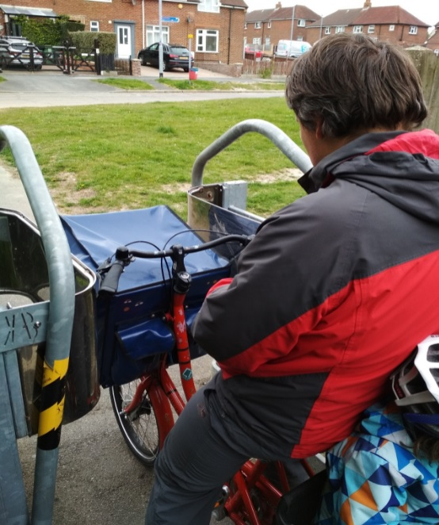
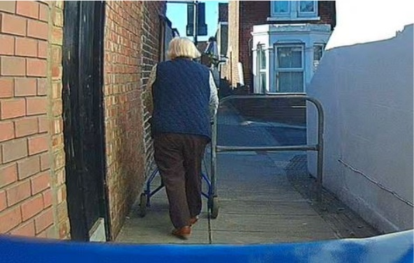
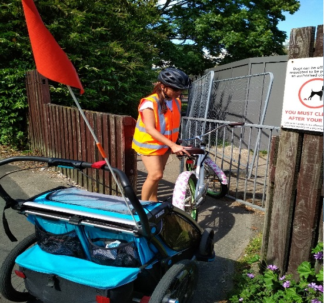

**We invited Charles Dickens Ward councillors for a ‘barrier tour’**

This summer we welcomed an announcement about Charles Dickens Ward winning a £423,851 grant from the Government's Safer Streets Fund. Projects funded by this initiative aim to improve safety by introducing situational crime prevention measures.

However, following the news we also raised concerns about potential plans to spend some of these funds on installation of K-Barriers down alleyways as a way to prevent mopeds and motorcycles. Trouble is, K-Barriers and barriers alike also prevent cycles, double buggies, walking aids and mobility scooters, all of whom struggle and cannot get through. Those who cannot get past barriers often have to use alternative routes which are likely to be much busier, longer, inconvenient and uncomfortable.

What is more, installation of barriers could clash with the council’s public sector equality duty under the Equality Act 2010. Barriers can prevent or limit access for people with protected characteristics which can make them feel discriminated against.

Unsurprisingly, there have been numerous organisations and individuals asking councils to stop putting barriers on cycle paths and pathways. You can read about some of the campaigns and protests here:

Wheels for Wellbeing - [**Campaigning for inclusive cycling**](https://wheelsforwellbeing.org.uk/bash-the-barriers/)

Camcycle - [**TAKE ACTION: help us remove dangerous new barriers to cycling in Cambridgeshire**](https://www.camcycle.org.uk/blog/2021/02/take-action-remove-barriers-to-cycling-in-cambridgeshire/)

Sustrans - [**Why removing restrictive barriers must be part of our response to Covid-19**](https://www.sustrans.org.uk/our-blog/opinion/2020/june/why-removing-restrictive-barriers-must-be-part-of-our-response-to-covid-19)

York Cycle Campaign - [**Taking Legal Action on Barriers**](https://yorkcyclecampaign.bike/2021/03/20/taking-legal-action-on-barriers/)

Cycle Sheffield - [**(Installing) barriers to active travel**](https://www.cyclesheffield.org.uk/2017/01/04/barriers-on-cycle-paths/)

Pedals Nottingham - [**Pedals Protest Plans for Cycle Path Barriers**](http://pedals.org.uk/2019/05/05/pedals-protest-plans-for-cycle-path-barriers/)

The Ranty Highwayman - [**#BashTheBarriers**](https://therantyhighwayman.blogspot.com/2016/01/bashthebarriers.html)

_Photo 1 Cargo bicycle with loaded front bag_  
_and child at rear stuck at K-Barrier (Portsmouth)_

_Photo 2 Elderly person with walker struggling to get past the barrier on a path (Portsmouth)_

  
_Photo 3 Bicycle with a child trailer struggling to get through a barrier (Portsmouth)_

So we invited councillors from Charles Dickens Ward for a tour, during which we discussed why installing K-Barriers and barriers in general may not be the best solution to increasing safety, but in fact do the opposite, decreasing footfall, restricting mobility and access, as well as discouraging active travel.

We were joined by Cllr Cal Corkery from Charles Dickens Ward and cycled through Landport area which is considered for safety improvements. During the ride we emphasised that barriers not only prevent access for legitimate users, but also can make spaces feel less safe, particularly at night, particularly for women.

According to the project's **[website](https://www.hampshire-pcc.gov.uk/get-involved/taking-action/safer-streets/portsmouth-2021)** the proposed measures have already been confirmed. We have requested more details whether any of the access limiting barriers have been approved. Meanwhile, there is an opportunity for anyone who lives, works or visits the area to express views on the project by filling in the [**survey**](https://survey.alchemer.eu/s3/90366813/Safer-Streets-Fund-2). The project's completion is planned for March 2022.

Have you been affected by barriers on cycle paths and pathways in Portsmouth? We would like to hear about your experiences.
