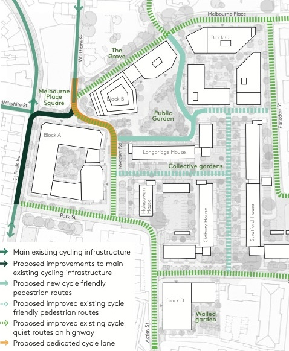

Happy New Year PCF-ers! Hope you all had a great break and have been enjoying the milder weather for all your cycling journeys.

This month's committee meeting was bumper packed. We heard how Rich has taught Nicola to publish to the website, and that they'll shortly be creating a crib-sheet and video to help anyone else who'd like to join in.

We learned about [HackPompey](https://hackpompey.co.uk/), which is a one-day hackathon where people come together to take data and ideas and turn them into something wonderful.  They are keen to use anything we can give them for the upcoming event on March 16th.  So far we've thought about better visualisations of casualty data, but maybe you have more ideas?  What data woudl you like to see presented in an easy to uhnderstand form?  What tool or app do you wish existed?  Let us know in the usual way. 

Melbourne Place (the site of the demolished Horatia House near the university) is in for planning. The applicant has done a fairly good job in considering cycling so we're reviewing the finer points. If you cycle through there and have experience of existing issues, or ideas on what could be better, let us know so we can submit a response.

 

Three objections have been submitted to planning applications for Fraser Range, St Johns College, and the proposed move of the bus depot to The News site.  None of these have done enough to consider cycling and we'll be pushing PCC for 20mph limits around St Johns, among other things. 

University House is also due to be demolished and we're expecting a planning application soon so shout if there's anything you want us to capture. 

We have already had interest in our new [#werideportsmouth](/tags/werideportsmouth) initiative and look forward to sharing the first story shortly.

Delivery of the east-west active travel corridor (Goldsmith Ave, Winston Churchill Ave and Guildhall Walk) is underway, as are the first of the [Transforming Cities](https://www.gov.uk/government/publications/apply-for-the-transforming-cities-fund) schemes.  By the summer we expect to have a host of new infrastructure to visit! 

A traffic regulation order for Canal Walk, seeking to make the traffic filter permanent, is now out to consultation. Do drop a line to PCC and your local councillor to show your support (more details in our upcoming email bulletin). 

And last but not least, we were joined by Dr Lee Woods who teaches civil engineering at the University, to see how we can collaborate with him and his students.  We're looking forward to seeing him at a future open meeting and hearing about some of his exciting projects. 
