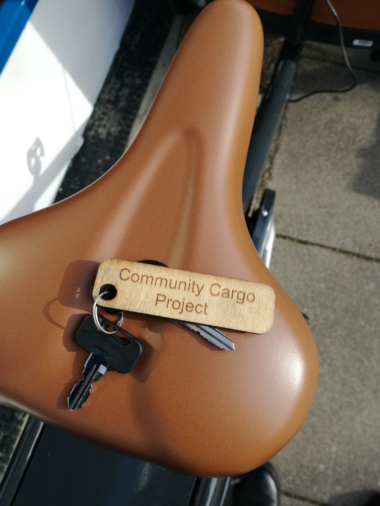

---

title: Community Cargo Project
date: 2022-03-08
tags:  
  - bikes
  - latest-news 
  - bike-hire
  - cargo-bikes
coverImage: "./IMG_20220205_120128.jpg"
---

# How to hire a cargo bike in Portsmouth

In 2021 following a successful Crowdfunder initiated by Southsea Cycles, Sustrans and Portsmouth Climate Action Board, a Community Cargo Project was born. The project aims to make electric cargo bikes available to hire at a low cost so that more people can access the benefits of cargo biking. The funds raised allowed the purchase of two electric cargo bikes. A Babboe Curve trike is now available to try out while second one – a Babboe City Mountain two-wheeler is coming soon.

## What you can hire:

- Electric Babboe Curve – three-wheeler box bike perfect to transport large weekly shopping or up to 4 children. Benches are equipped with four three-point harnesses. A rain cover can be requested for riding in wet weather. Front box loading capacity is 100 kg.

- Coming soon - Electric Babboe City Mountain – two-wheeler cargo bike which can accommodate up to two children or your weekly grocery shop. Front box loading capacity is 80 kg. 

- Accessories such as helmets and locks are also available to hire in the shop, just ask.

## Here is how and when:

- Join the Community Cargo Project via three, six or twelve month membership before hiring. Membership can be purchased via Southsea Cycles [**webpage**.](https://www.southsea-cycles.co.uk/collections/cargo-bike-hire)
- It is not necessary to book in advance, however it is a good idea to check the availability by contacting the shop – either via **[webpage](https://www.southsea-cycles.co.uk/collections/cargo-bike-hire)** or by phone:  023 9229 7549. Saturday hires are especially popular! 

- The bike can be collected from and returned to Southsea Cycles shop on 235-237 Albert Road, Portsmouth, PO4 0JR
- When booking have your membership number to hand.
- Go to the shop, read and sign the hire agreement, get your keys and rock the road

- Pay your fee when you return to the shop. The cost is only £1.20 per hour. 
- The cargo bike can be hired for full day or just an hour, but must be returned by shop’s closing time: 

<table><tbody><tr><td>Monday</td><td>10am–6:30pm</td></tr><tr><td>Tuesday&nbsp;&nbsp;&nbsp;</td><td>10am–6:30pm</td></tr><tr><td>Wednesday&nbsp;&nbsp;&nbsp;</td><td>10am–6:30pm</td></tr><tr><td>Thursday&nbsp;&nbsp;&nbsp;</td><td>10am–6:30pm</td></tr><tr><td>Friday&nbsp;&nbsp;&nbsp; &nbsp; &nbsp; &nbsp; &nbsp; &nbsp;</td><td>10am–6:30pm</td></tr><tr><td>Saturday&nbsp; &nbsp; &nbsp; &nbsp;</td><td>9am–5pm</td></tr><tr><td>Sunday&nbsp;&nbsp;&nbsp;</td><td>Closed</td></tr></tbody></table>

## Top tips

- Grab a blanket for your passengers if riding in colder weather, they will appreciate it
- Take it easy if this is your first time, practice makes perfect
- You may be surprised to notice that some drivers will give you more space, that is the cargo bike effect!

Happy cargo bike riding!
